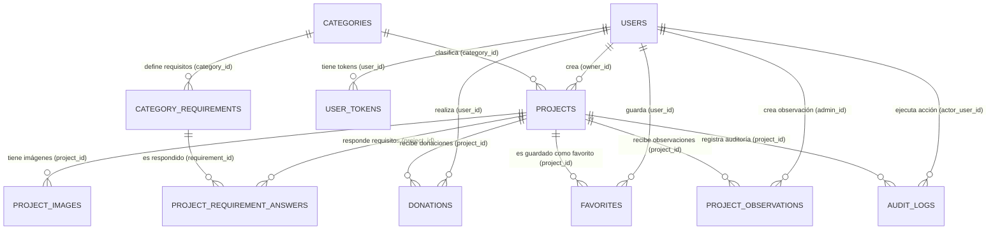
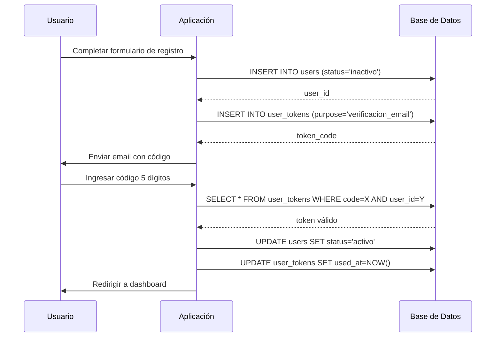
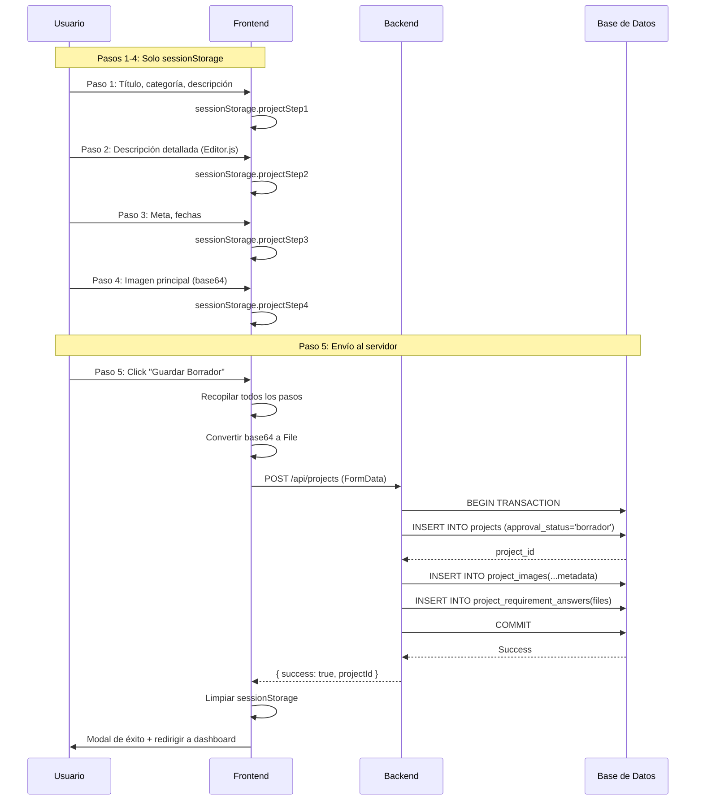
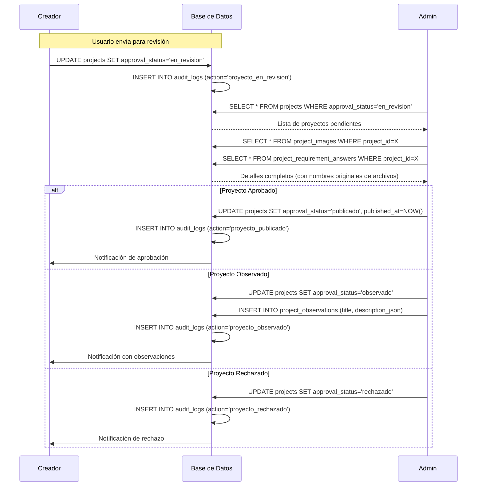
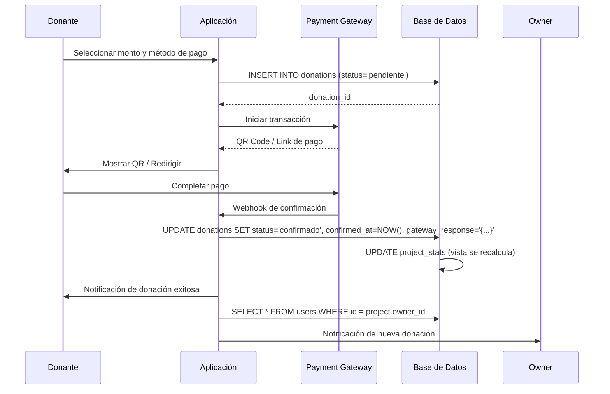
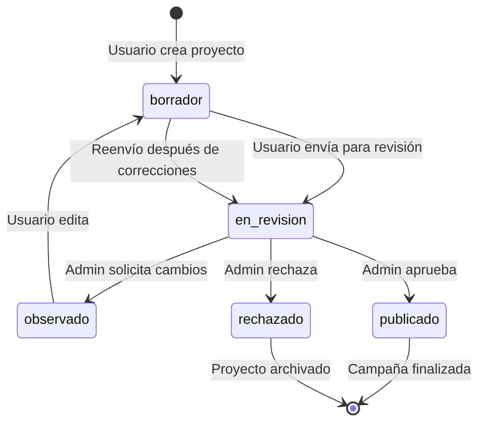
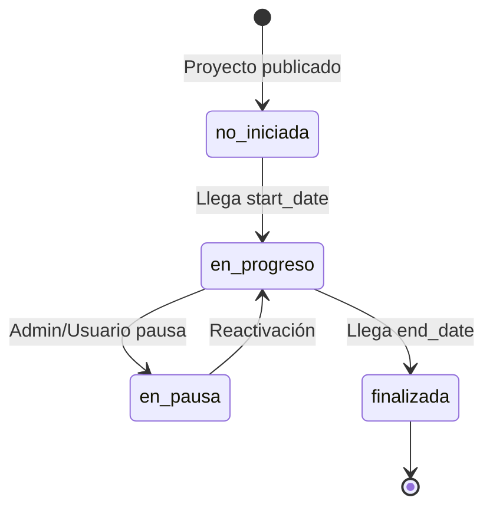

# Análisis Completo de Relaciones de Base de Datos - ImpúlsaMe

## Índice

1. [Diagrama de Relaciones](#diagrama-de-relaciones)
2. [Tablas y Sus Relaciones](#tablas-y-sus-relaciones)
3. [Flujos de Datos por Funcionalidad](#flujos-de-datos-por-funcionalidad)
4. [Ciclo de Vida del Proyecto](#ciclo-de-vida-del-proyecto)
5. [Integridad Referencial y Cascadas](#integridad-referencial-y-cascadas)
6. [Consultas Típicas](#consultas-típicas)

---

## Diagrama de Relaciones



---

## Tablas y Sus Relaciones

### 1. **`users`** - Tabla Central de Usuarios

**Propósito**: Almacenar información de todos los usuarios (creadores y donantes)

**Campos Clave**:

- `id` (BIGSERIAL) - PK
- `email` (CITEXT) - UNIQUE, case-insensitive
- `role` (ENUM) - 'usuario' | 'admin'
- `status` (ENUM) - 'inactivo' | 'activo' | 'bloqueado'

**Relaciones**:

1. **1:N con `projects`** (como `owner_id`)
   - Un usuario puede crear múltiples proyectos
   - `ON DELETE RESTRICT` - No se puede eliminar usuario con proyectos
2. **1:N con `donations`** (como `user_id`)
   - Un usuario puede hacer múltiples donaciones
   - `ON DELETE RESTRICT` - Preserva historial de donaciones
3. **1:N con `favorites`** (como `user_id`)
   - Un usuario puede guardar múltiples proyectos favoritos
   - `ON DELETE CASCADE` - Al eliminar usuario, se eliminan sus favoritos
4. **1:N con `user_tokens`** (como `user_id`)

   - Tokens de verificación y reset de contraseña
   - `ON DELETE CASCADE` - Tokens se eliminan con el usuario

5. **1:N con `project_observations`** (como `admin_id`)

   - Solo admins crean observaciones
   - `ON DELETE RESTRICT` - Preserva historial de revisiones

6. **1:N con `audit_logs`** (como `actor_user_id` y `target_user_id`)
   - Registra acciones administrativas
   - `ON DELETE RESTRICT` - Preserva auditoría

**Uso en la Aplicación**:

- Registro y autenticación
- Creación de proyectos
- Donaciones y favoritos
- Panel de administración

---

### 2. **`user_tokens`** - Tokens de Verificación

**Propósito**: Códigos temporales para verificación de email y reset de contraseña

**Campos Clave**:

- `code` (CHAR(5)) - Código numérico de 5 dígitos
- `purpose` (ENUM) - 'verificacion_email' | 'reset_password'
- `expires_at` (TIMESTAMP) - Por defecto NOW() + 15 minutos
- `used_at` (TIMESTAMP) - NULL hasta que se usa

**Relaciones**:

- **N:1 con `users`** - FK `user_id`
- **ON DELETE CASCADE** - Tokens se eliminan con el usuario

**Uso en la Aplicación**:

- Activación de cuenta
- Recuperación de contraseña
- Validación con expiración automática

---

### 3. **`categories`** - Categorías de Proyectos

**Propósito**: Clasificación de proyectos (Tecnología, Salud, Educación, etc.)

**Campos Clave**:

- `id` (SERIAL) - PK
- `name` (VARCHAR(80)) - UNIQUE
- `description` (TEXT)

**Relaciones**:

1. **1:N con `projects`** (como `category_id`)

   - Una categoría agrupa múlt iples proyectos
   - `ON DELETE RESTRICT` - No eliminar categorías con proyectos

2. **1:N con `category_requirements`** (como `category_id`)
   - Define requisitos específicos por categoría
   - `ON DELETE CASCADE` - Requisitos se eliminan con categoría

**Uso en la Aplicación**:

- Filtrado y búsqueda de proyectos
- Definir requisitos dinámicos por tipo de proyecto
- Estadísticas por categoría

---

### 4. **`category_requirements`** - Requisitos Dinámicos

**Propósito**: Definir campos personalizados por categoría (ej: RUC para empresas)

**Campos Clave**:

- `code` (VARCHAR(50)) - Identificador único del requisito
- `label` (VARCHAR(120)) - Etiqueta para el usuario
- `type` (ENUM) - 'texto', 'archivo', 'url', 'numero', etc.
- `required` (BOOLEAN)
- `is_active` (BOOLEAN) - Para soft-deprecation
- `retiring_at` / `retire_reason` - Gestión de ciclo de vida

**Relaciones**:

- **N:1 con `categories`** - FK `category_id`
- **1:N con `project_requirement_answers`** - Respuestas de proyectos
  - `ON DELETE RESTRICT` - Preserva respuestas aunque requisito se retire

**Uso en la Aplicación**:

- Formularios dinámicos en creación de proyectos
- Validaciones específicas por categoría
- Admin puede agregar/retirar requisitos sin romper datos existentes

---

### 5. **`projects`** ⭐ - Tabla Principal de Proyectos

**Propósito**: Almacenar todos los proyectos (borradores, en revisión, publicados)

**Campos Clave**:

- `owner_id` (BIGINT) - FK a `users`, creador del proyecto
- `category_id` (INT) - FK a `categories`
- `title` (VARCHAR(140))
- `summary` (VARCHAR(300)) - Descripción corta
- `description_json` (JSONB) - Contenido de Editor.js
- `goal_amount` (DECIMAL(12,2)) - Meta de financiación
- `start_date`, `end_date` (DATE) - Duración de campaña
- **`approval_status`** (ENUM) - **'borrador' | 'en_revision' | 'observado' | 'publicado' | 'rechazado'**
- **`campaign_state`** (ENUM) - 'no_iniciada' | 'en_progreso' | 'en_pausa' | 'finalizada'
- `deleted_at` (TIMESTAMP) - Soft delete para KPIs

**Relaciones**:

1. **N:1 con `users`** (owner)

   - `ON DELETE RESTRICT` - Preserva proyectos de usuarios eliminados

2. **N:1 con `categories`**

   - `ON DELETE RESTRICT` - No eliminar categorías con proyectos

3. **1:N con `project_images`**

   - Imágenes del proyecto (portada + galería)
   - `ON DELETE CASCADE` - Imágenes se eliminan con el proyecto

4. **1:N con `project_requirement_answers`**

   - Respuestas a requisitos dinámicos
   - `ON DELETE CASCADE` - Respuestas se eliminan con el proyecto

5. **1:N con `project_observations`**

   - Observaciones de admins durante revisión
   - `ON DELETE CASCADE` - Observaciones se eliminan con el proyecto

6. **1:N con `donations`**

   - Donaciones recibidas
   - `ON DELETE RESTRICT` - Preserva historial financiero

7. **1:N con `favorites`**
   - Usuarios que guardaron el proyecto
   - `ON DELETE CASCADE` - Favoritos se eliminan con el proyecto

**Índices Importantes**:

- `idx_projects_owner` - Queries por usuario
- `idx_projects_category` - Filtrado por categoría
- `idx_projects_status` - Filtrado por estado de aprobación
- `idx_projects_end_date` - Listar próximos a finalizar
- `idx_projects_created_at` - Ordenamiento cronológico

**Uso en la Aplicación**:

- Creación de proyectos (flujo de 5 pasos)
- Dashboard de usuario
- Dashboard de admin (revisión)
- Listado público (solo `approval_status = 'publicado'`)
- KPIs y estadísticas

---

### 6. **`project_images`** - Imágenes del Proyecto

**Propósito**: Almacenar portada y galería de imágenes

**Campos Clave**:

- `url` (TEXT) - Ruta del archivo: `/uploads/projects/images/uuid-timestamp-nombre.jpg`
- **`original_filename`** (VARCHAR(255)) - Nombre original del usuario _(agregado en migración)_
- **`file_size`** (INTEGER) - Tamaño en bytes _(agregado en migración)_
- **`mime_type`** (VARCHAR(100)) - Tipo MIME _(agregado en migración)_
- `position` (SMALLINT) - Orden en galería (1-10)
- `is_cover` (BOOLEAN) - Solo una portada por proyecto (índice único)
- `alt_text` (VARCHAR(140)) - Accesibilidad

**Constraints**:

- `UNIQUE (project_id, position)` - No duplicar posiciones
- `UNIQUE INDEX ux_proj_images_cover ON (project_id) WHERE is_cover = TRUE`

**Relaciones**:

- **N:1 con `projects`** - FK `project_id`
- **ON DELETE CASCADE** - Se eliminan con el proyecto

**Uso en la Aplicación**:

- Paso 4 del formulario de creación
- Vista pública del proyecto
- Admin puede ver nombre original del archivo

---

### 7. **`project_requirement_answers`** - Respuestas a Requisitos y Documentos

**Propósito**: Almacenar respuestas a requisitos dinámicos Y documentos adjuntos

**Campos Clave**:

- `project_id` (BIGINT) - FK a `projects`
- `requirement_id` (INT) - FK a `category_requirements` (NULLABLE)
- `value_text` (TEXT) - Respuesta textual
- `value_json` (JSONB) - Respuestas estructuradas
- `file_url` (TEXT) - Ruta a documento: `/uploads/projects/documents/uuid-timestamp-nombre.pdf`
- **`original_filename`** (VARCHAR(255)) - Nombre original _(agregado en migración)_
- **`file_size`** (INTEGER) - Tamaño en bytes _(agregado en migración)_
- **`mime_type`** (VARCHAR(100)) - Tipo MIME _(agregado en migración)_

**Constraints**:

- `UNIQUE (project_id, requirement_id)` - Una respuesta por requisito

**Relaciones**:

1. **N:1 con `projects`**

   - `ON DELETE CASCADE` - Respuestas se eliminan con el proyecto

2. **N:1 con `category_requirements`**
   - `ON DELETE RESTRICT` - Preserva respuestas aunque requisito se retire
   - **NULLABLE** - Permite documentos sin requisito específico (Paso 5)

**Uso en la Aplicación**:

- Paso 5: Requisitos textuales y documentos adjuntos
- Formularios dinámicos por categoría
- Admin revisa documentos con nombre original visible

**Casos de Uso**:

```javascript
// Documento del Paso 5 (sin requisito específico)
{
  project_id: 123,
  requirement_id: NULL,
  value_text: "Requisitos generales del proyecto",
  file_url: "/uploads/projects/documents/uuid-12345-presupuesto.pdf",
  original_filename: "Presupuesto Detallado 2025.pdf",
  file_size: 512000,
  mime_type: "application/pdf"
}

// Respuesta a requisito dinámico
{
  project_id: 123,
  requirement_id: 5, // ej: "RUC de la empresa"
  value_text: "123456789-0",
  file_url: NULL
}
```

---

### 8. **`project_observations`** - Observaciones de Admins

**Propósito**: Historial de comentarios de admins durante revisión

**Campos Clave**:

- `project_id` (BIGINT) - FK a `projects`
- `admin_id` (BIGINT) - FK a `users` (debe ser admin)
- `title` (VARCHAR(140))
- `description_json` (JSONB) - Contenido rico (Editor.js)

**Relaciones**:

- **N:1 con `projects`** - `ON DELETE CASCADE`
- **N:1 con `users`** (admin) - `ON DELETE RESTRICT`

**Uso en la Aplicación**:

- Workflow de revisión de proyectos
- Notificar al creador sobre cambios necesarios
- Historial de auditoría

---

### 9. **`donations`** - Donaciones/Aportes

**Propósito**: Registrar todas las donaciones a proyectos

**Campos Clave**:

- `user_id` (BIGINT) - FK a `users` (donante)
- `project_id` (BIGINT) - FK a `projects`
- `amount` (DECIMAL(12,2))
- `status` (ENUM) - 'pendiente' | 'confirmado' | 'fallido'
- `payment_method` (VARCHAR(30)) - Ej: 'qr', 'stripe', etc.
- `payment_reference` (VARCHAR(100))
- `gateway_response` (JSONB) - Respuesta completa del gateway
- `confirmed_at` (TIMESTAMP) - Cuando se confirmó el pago

**Índices**:

- `idx_donations_project_status` - Queries por estado/proyecto
- `idx_donations_user` - Historial del donante
- `idx_donations_created` - Ordenamiento

**Relaciones**:

- **N:1 con `users`** - `ON DELETE RESTRICT` (preservar historial)
- **N:1 con `projects`** - `ON DELETE RESTRICT` (preservar historial)

**Uso en la Aplicación**:

- Proceso de donación
- Cálculo de progreso del proyecto
- Estadísticas de financiación
- Vista `project_stats` (agrupa donaciones confirmadas)

---

### 10. **`favorites`** - Proyectos Guardados

**Propósito**: Lista de favoritos de cada usuario

**Campos Clave**:

- Clave compuesta: `PRIMARY KEY (user_id, project_id)`

**Relaciones**:

- **N:1 con `users`** - `ON DELETE CASCADE`
- **N:1 con `projects`** - `ON DELETE CASCADE`

**Uso en la Aplicación**:

- Botón "Guardar" en proyectos
- Dashboard de usuario - "Mis Favoritos"
- Notificaciones de actualizaciones

---

### 11. **`audit_logs`** - Auditoría Administrativa

**Propósito**: Registrar acciones críticas de admins

**Campos Clave**:

- `actor_user_id` (BIGINT) - Admin que ejecuta la acción
- `action` (ENUM) - 'proyecto_en_revision', 'proyecto_publicado', 'usuario_bloqueado', etc.
- `project_id` (BIGINT) - NULLABLE, si aplica
- `target_user_id` (BIGINT) - NULLABLE, si aplica
- `details_json` (JSONB) - Detalles adicionales

**Relaciones**:

- **N:1 con `users`** (actor) - `ON DELETE RESTRICT`
- **N:1 con `projects`** (opcional) - `ON DELETE CASCADE`
- **N:1 con `users`** (target) - `ON DELETE RESTRICT`

**Uso en la Aplicación**:

- Dashboard de auditoría
- Trazabilidad de decisiones administrativas

---

### 12. **`project_stats`** (VISTA) - Métricas de Proyectos

**Propósito**: Vista materializada para rendimiento de consultas

**Campos Calculados**:

- `total_confirmed_amount` - Suma de donaciones confirmadas
- `supporters_count` - Número de donantes únicos
- `progress_percent` - Porcentaje de la meta alcanzada
- `progress_bucket` - Categorización: 'completamente_financiado', 'mayor_75', etc.

**Uso en la Aplicación**:

- Listado de proyectos con barras de progreso
- Filtrado por nivel de financiación
- Home page - proyectos destacados

---

## Flujos de Datos por Funcionalidad

### 🚀 **Flujo 1: Registro y Activación de Usuario**



**Tablas Involucradas**:

1. `users` - Nuevo usuario con status 'inactivo'
2. `user_tokens` - Código de 5 dígitos con expiración 15 min

---

### 📝 **Flujo 2: Creación de Proyecto (5 Pasos)**



**Tablas Involucradas**:

1. `projects` - Registro principal con `approval_status = 'borrador'`
2. `project_images` - Imagen portada con metadata (original_filename, file_size, mime_type)
3. `project_requirement_answers` - Documentos adjuntos con metadata

**Archivos en Filesystem**:

- `/public/uploads/projects/images/uuid-timestamp-portada.jpg`
- `/public/uploads/projects/documents/uuid-timestamp-presupuesto.pdf`

---

### 🔍 **Flujo 3: Revisión y Aprobación de Proyecto (Admin)**



**Tablas Involucradas**:

1. `projects` - Cambio de `approval_status`
2. `project_observations` - Comentarios del admin (si hay observaciones)
3. `audit_logs` - Registro de la acción admin istrat iva

---

### 💰 **Flujo 4: Donación a Proyecto**



**Tablas Involucradas**:

1. `donations` - Registro de donación (pendiente → confirmado)
2. `project_stats` (VISTA) - Se actualiza automáticamente con el nuevo monto
3. `users` - Para notificar al creador del proyecto

---

### 📊 **Flujo 5: Dashboard de Usuario - Mis Proyectos**

```sql
-- Query típica del dashboard
SELECT
  p.id,
  p.title,
  p.approval_status,
  p.campaign_state,
  p.created_at,
  p.published_at,
  COALESCE(ps.total_confirmed_amount, 0) as raised,
  p.goal_amount,
  COALESCE(ps.progress_percent, 0) as progress,
  COALESCE(ps.supporters_count, 0) as supporters,
  pi.url as cover_image
FROM projects p
LEFT JOIN project_stats ps ON p.id = ps.project_id
LEFT JOIN project_images pi ON p.id = pi.project_id AND pi.is_cover = TRUE
WHERE p.owner_id = $1 AND p.deleted_at IS NULL
ORDER BY p.created_at DESC;
```

**Muestra**:

- Borradores ('borrador')
- En revisión ('en_revision')
- Observados ('observado')
- Publicados ('publicado')

**Interacciones**:

- Click en "Borrador" → Continuar edición (según approval_status)
- Click en "Publicado" → Ver página pública del proyecto
- Click en "Observado" → Ver observaciones del admin

---

## Ciclo de Vida del Proyecto

### Estados de `approval_status`:



### Estados de `campaign_state`:



**Lógica de Negocio**:

- Un proyecto solo puede recibir donaciones si:
  - `approval_status = 'publicado'`
  - `campaign_state = 'en_progreso'`
  - `end_date > NOW()`

---

## Integridad Referencial y Cascadas

### Resumen de Acciones ON DELETE:

| Relación                                                                | Acción ON DELETE | Justificación                                      |
| ----------------------------------------------------------------------- | ---------------- | -------------------------------------------------- |
| `projects.owner_id → users.id`                                          | **RESTRICT**     | Preservar proyectos de usuarios eliminados         |
| `projects.category_id → categories.id`                                  | **RESTRICT**     | No eliminar categorías con proyectos activos       |
| `project_images.project_id → projects.id`                               | **CASCADE**      | Imágenes son parte del proyecto                    |
| `project_requirement_answers.project_id → projects.id`                  | **CASCADE**      | Respuestas/documentos son parte del proyecto       |
| `project_requirement_answers.requirement_id → category_requirements.id` | **RESTRICT**     | Preservar respuestas aunque requisito se retire    |
| `project_observations.project_id → projects.id`                         | **CASCADE**      | Observaciones son parte del historial del proyecto |
| `donations.user_id → users.id`                                          | **RESTRICT**     | Preservar historial financiero                     |
| `donations.project_id → projects.id`                                    | **RESTRICT**     | Preservar historial financiero                     |
| `favorites.user_id → users.id`                                          | **CASCADE**      | Favoritos personales se eliminan con usuario       |
| `favorites.project_id → projects.id`                                    | **CASCADE**      | Favoritos se eliminan con proyecto                 |
| `user_tokens.user_id → users.id`                                        | **CASCADE**      | Tokens temporales no son críticos                  |
| `audit_logs.actor_user_id → users.id`                                   | **RESTRICT**     | Preservar auditoría                                |
| `audit_logs.project_id → projects.id`                                   | **CASCADE**      | Logs de proyecto se eliminan con él                |

### Soft Delete

**Tabla `projects`**:

- Usa `deleted_at` (TIMESTAMP NULL) en lugar de DELETE físico
- Permite cálculo de KPIs históricos
- Los índices excluyen proyectos eliminados: `WHERE deleted_at IS NULL`

**Ejemplo de Soft Delete**:

```sql
-- En lugar de:
DELETE FROM projects WHERE id = 123;

-- Hacer:
UPDATE projects SET deleted_at = NOW() WHERE id = 123;
```

---

## Consultas Típicas

### 1. **Listar Proyectos Públicamente**

```sql
SELECT
  p.id,
  p.title,
  p.summary,
  c.name as category,
  ps.total_confirmed_amount,
  ps.progress_percent,
  ps.supporters_count,
  p.end_date,
  pi.url as cover_image
FROM projects p
JOIN categories c ON p.category_id = c.id
LEFT JOIN project_stats ps ON p.id = ps.project_id
LEFT JOIN project_images pi ON p.id = pi.project_id AND pi.is_cover = TRUE
WHERE p.approval_status = 'publicado'
  AND p.campaign_state = 'en_progreso'
  AND p.deleted_at IS NULL
ORDER BY p.created_at DESC
LIMIT 20;
```

### 2. **Detalles del Proyecto con Todo**

```sql
-- Proyecto principal
SELECT p.*, c.name as category_name, u.full_name as owner_name
FROM projects p
JOIN categories c ON p.category_id = c.id
JOIN users u ON p.owner_id = u.id
WHERE p.id = $1;

-- Imágenes (con metadata)
SELECT id, url, original_filename, file_size, mime_type, position, is_cover, alt_text
FROM project_images
WHERE project_id = $1
ORDER BY position;

-- Documentos (con metadata)
SELECT id, file_url, original_filename, file_size, mime_type, value_text
FROM project_requirement_answers
WHERE project_id = $1 AND file_url IS NOT NULL;

-- Respuestas a requisitos
SELECT
  pra.value_text,
  pra.value_json,
  cr.label,
  cr.type
FROM project_requirement_answers pra
JOIN category_requirements cr ON pra.requirement_id = cr.id
WHERE pra.project_id = $1 AND pra.requirement_id IS NOT NULL;
```

### 3. **KPIs del Home**

```sql
-- Total de proyectos financiados
SELECT COUNT(*)
FROM project_stats ps
JOIN projects p ON ps.project_id = p.id
WHERE ps.progress_percent >= 100
  AND p.approval_status = 'publicado'
  AND p.deleted_at IS NULL;

-- Total recaudado
SELECT SUM(total_confirmed_amount)
FROM project_stats ps
JOIN projects p ON ps.project_id = p.id
WHERE p.approval_status = 'publicado'
  AND p.deleted_at IS NULL;

-- Creadores apoyados
SELECT COUNT(DISTINCT p.owner_id)
FROM projects p
JOIN donations d ON p.id = d.project_id
WHERE d.status = 'confirmado'
  AND p.deleted_at IS NULL;
```

### 4. **Dashboard de Admin - Proyectos Pendientes**

```sql
SELECT
  p.id,
  p.title,
  p.created_at,
  u.full_name as creator,
  u.email,
  c.name as category,
  COUNT(pi.id) as image_count,
  COUNT(DISTINCT pra.id) FILTER (WHERE pra.file_url IS NOT NULL) as document_count
FROM projects p
JOIN users u ON p.owner_id = u.id
JOIN categories c ON p.category_id = c.id
LEFT JOIN project_images pi ON p.id = pi.project_id
LEFT JOIN project_requirement_answers pra ON p.id = pra.project_id
WHERE p.approval_status = 'en_revision'
  AND p.deleted_at IS NULL
GROUP BY p.id, u.full_name, u.email, c.name
ORDER BY p.created_at ASC;
```

### 5. **Proyectos Próximos a Finalizar**

```sql
SELECT
  p.id,
  p.title,
  p.end_date,
  (p.end_date - CURRENT_DATE) as days_remaining,
  ps.progress_percent,
  ps.total_confirmed_amount,
  p.goal_amount
FROM projects p
LEFT JOIN project_stats ps ON p.id = ps.project_id
WHERE p.approval_status = 'publicado'
  AND p.campaign_state = 'en_progreso'
  AND p.end_date BETWEEN CURRENT_DATE AND CURRENT_DATE + INTERVAL '7 days'
  AND p.deleted_at IS NULL
ORDER BY p.end_date ASC;
```

---

## Manejo de Archivos

### Estructura de Directorios:

```
public/
└── uploads/
    └── projects/
        ├── images/
        │   ├── uuid-12345-portada-proyecto.jpg
        │   └── uuid-67890-galeria-1.png
        └── documents/
            ├── uuid-11111-presupuesto-detallado.pdf
            ├── uuid-22222-carta-de-apoyo.docx
            └── uuid-33333-plan-de-trabajo.xlsx
```

### Tabla de Metadata:

| Campo DB            | Propósito                     | Ejemplo                                         |
| ------------------- | ----------------------------- | ----------------------------------------------- |
| `url`               | Ruta para servir archivo      | `/uploads/projects/images/uuid-...-portada.jpg` |
| `original_filename` | Nombre del usuario (admin)    | "Portada de mi Proyecto 2025.jpg"               |
| `file_size`         | Control de cuotas / UI        | 2048576 (bytes)                                 |
| `mime_type`         | Validación / Download headers | "image/jpeg"                                    |

### Query para Admin - Listar Archivos:

```sql
-- Imágenes de un proyecto
SELECT
  'Imagen' as tipo,
  original_filename as nombre,
  ROUND(file_size / 1024.0, 2) || ' KB' as tamaño,
  mime_type,
  created_at
FROM project_images
WHERE project_id = 123
UNION ALL
-- Documentos de un proyecto
SELECT
  'Documento' as tipo,
  original_filename,
  ROUND(file_size / 1024.0, 2) || ' KB',
  mime_type,
  created_at
FROM project_requirement_answers
WHERE project_id = 123 AND file_url IS NOT NULL
ORDER BY created_at;
```

---

## Resumen de Uso en la Aplicación

### Frontend Público:

1. **Home** → `projects` (publicados), `project_stats`, `categories`
2. **Explorar** → `projects` filtrados por categoría/estado
3. **Detalle de Proyecto** → `projects`, `project_images`, `project_requirement_answers`, `project_stats`
4. **Donar** → `donations`, actualiza `project_stats`

### Dashboard de Usuario:

1. **Mis Proyectos** → `projects` WHERE `owner_id = user_id`
2. **Crear Proyecto** → INSERT en `projects`, `project_images`, `project_requirement_answers`
3. **Editar Borrador** → UPDATE `projects` (solo si `approval_status = 'borrador'`)
4. **Mis Donaciones** → `donations` WHERE `user_id = user_id`
5. **Favoritos** → `favorites` JOIN `projects`

### Dashboard de Admin:

1. **Revisar Proyectos** → `projects` WHERE `approval_status = 'en_revision'`
2. **Crear Observaciones** → INSERT `project_observations`
3. **Aprobar/Rechazar** → UPDATE `projects.approval_status` + `audit_logs`
4. **Ver Archivos** → `project_images`, `project_requirement_answers` (con `original_filename`)
5. **Gestionar Usuarios** → `users` + `audit_logs`
6. **Estadísticas** → `project_stats`, agregaciones de `donations`

---

## Conclusión

La base de datos de ImpúlsaMe está diseñada con:

✅ **Integridad Referencial** estricta mediante FKs y constraints  
✅ **Soft Delete** en `projects` para preservar historial  
✅ **Auditoría** completa con `audit_logs` y `project_observations`  
✅ **Metadata de Archivos** para trazabilidad administrativa  
✅ **Vista Materializada** (`project_stats`) para rendimiento  
✅ **Flexibilidad** con requisitos dinámicos por categoría  
✅ **Workflow de Aprobación** con estados bien definidos

Este diseño soporta todo el ciclo de vida de crowdfunding: desde la creación de proyectos, revisión administrativa, campaña de donaciones, hasta el análisis de métricas.
