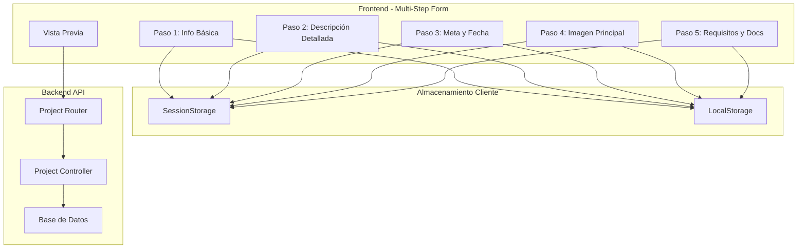
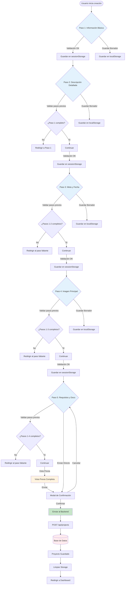
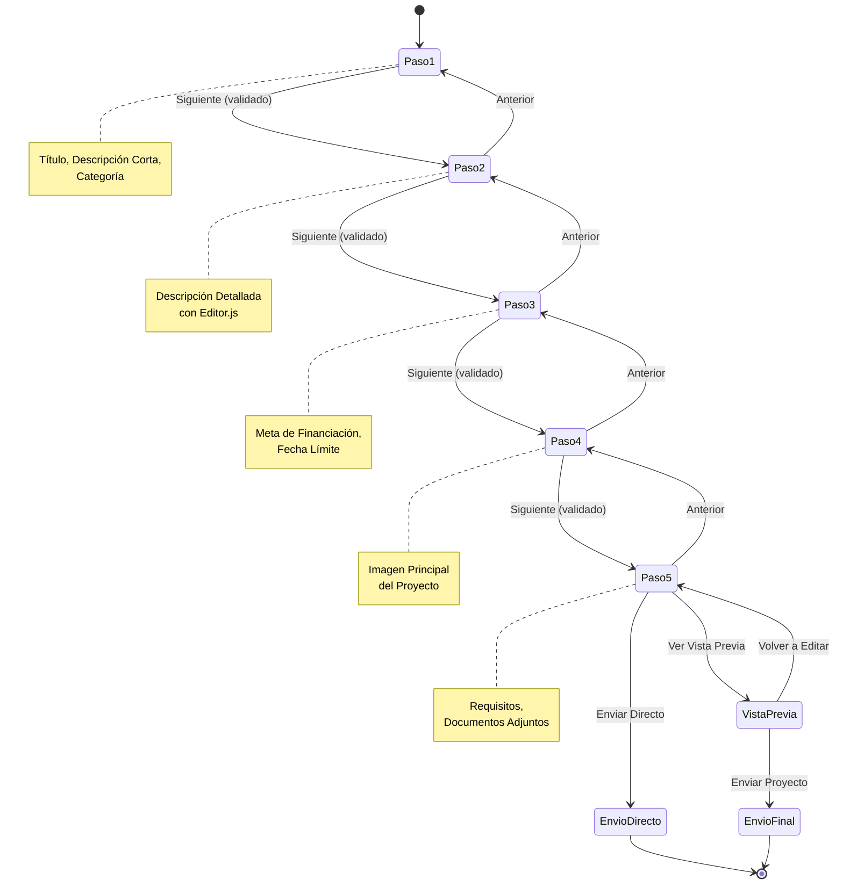
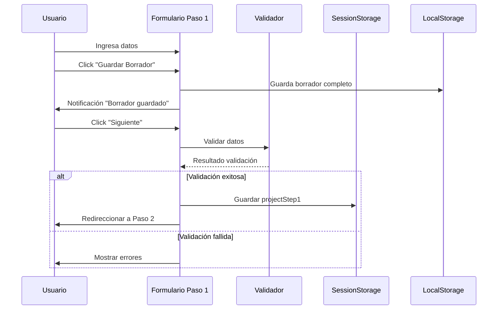
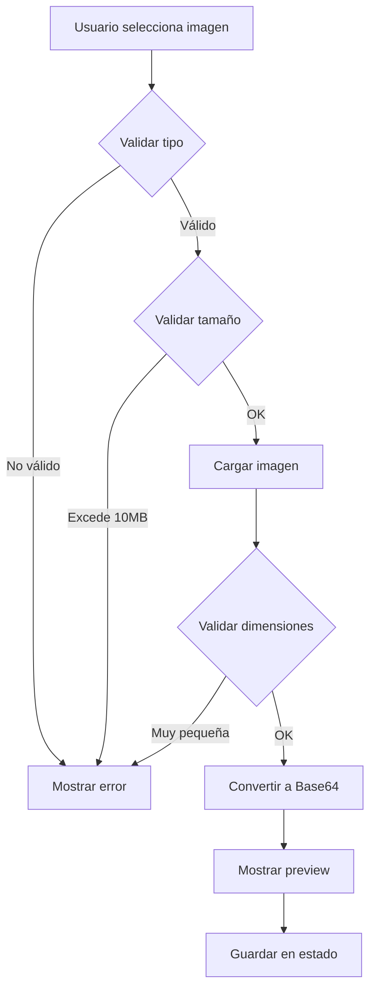
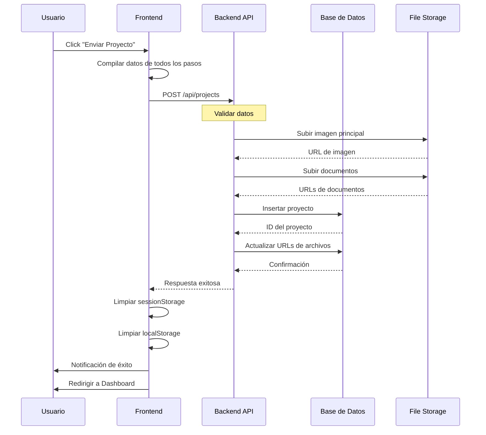

# 📋 Flujo de Creación de Proyectos - ImpúlsaMe

## 📖 Índice

1. [Visión General](#visión-general)
2. [Arquitectura del Sistema](#arquitectura-del-sistema)
3. [Flujo de Datos Detallado](#flujo-de-datos-detallado)
4. [Paso a Paso del Usuario](#paso-a-paso-del-usuario)
5. [Almacenamiento de Datos](#almacenamiento-de-datos)
6. [Validaciones](#validaciones)
7. [Integración con Backend](#integración-con-backend)

---

## Visión General

El sistema de creación de proyectos está implementado como un **formulario multi-paso** (wizard) de 5 pasos más una vista previa final. El usuario completa cada paso secuencialmente, con la capacidad de:

- ✅ Guardar borradores en cualquier momento
- ✅ Navegar hacia adelante y atrás entre pasos
- ✅ Ver una vista previa antes del envío final
- ✅ Validación en tiempo real
- ✅ Persistencia de datos entre sesiones

---

## Arquitectura del Sistema



---

## Flujo de Datos Detallado

### 1. Diagrama de Flujo General



### 2. Flujo de Navegación Entre Pasos



---

## Paso a Paso del Usuario

### 🔵 Paso 1: Información Básica

**Archivo:** `crear-proyecto.js`

#### Datos Capturados:

```javascript
{
  title: String,           // Título del proyecto (10-100 caracteres)
  description: String,     // Descripción corta (20-200 caracteres)
  category: String,        // Categoría seleccionada
  step: 1
}
```

#### Validaciones:

- ✅ Título obligatorio (mín. 10 caracteres)
- ✅ Descripción obligatoria (mín. 20 caracteres)
- ✅ Categoría obligatoria

#### Acciones del Usuario:

1. Completar formulario
2. **Guardar Borrador** → Guarda en `localStorage.projectDraft`
3. **Siguiente** → Valida y guarda en `sessionStorage.projectStep1` → Navega a Paso 2

#### Flujo de Datos:



---

### 🟢 Paso 2: Descripción Detallada

**Archivo:** `crear-proyecto-paso2.js`

#### Tecnologías:

- **Editor.js** - Editor WYSIWYG enriquecido
- Herramientas: Header, List, Quote, Code, Embed, Image, etc.

#### Datos Capturados:

```javascript
{
  blocks: [
    {
      type: "paragraph" | "header" | "list" | "quote" | ...,
      data: {
        text: String,
        level: Number,
        items: Array,
        // ... otros según tipo de bloque
      }
    }
  ],
  time: Number,
  version: String
}
```

#### Validaciones:

- ✅ Debe tener contenido (al menos 1 bloque)
- ✅ Contenido mínimo de 50 caracteres

#### Acciones del Usuario:

1. **Editor.js** se inicializa automáticamente
2. Crear contenido enriquecido
3. **Guardar Borrador** → Guarda en localStorage
4. **Anterior** → Vuelve a Paso 1 (guarda estado)
5. **Siguiente** → Valida y navega a Paso 3

#### Características Especiales:

- 🎨 Soporte para imágenes (drag & drop, upload, URL)
- 📝 Múltiples tipos de bloques
- 🌐 Internacionalización (i18n) en español
- 💾 Auto-guardado en borrador

---

### 🟡 Paso 3: Meta de Financiación y Fecha

**Archivo:** `crear-proyecto-paso3.js`

#### Datos Capturados:

```javascript
{
  goal: Number,              // Meta en euros
  end_date: String,          // Fecha ISO (YYYY-MM-DD)
  campaignDays: Number       // Calculado automáticamente
}
```

#### Validaciones:

- ✅ Meta mínima: €100
- ✅ Meta máxima: €10,000,000
- ✅ Campaña mínima: 7 días
- ✅ Campaña máxima: 90 días
- ✅ Fecha debe ser futura

#### Lógica de Negocio:

```javascript
// Calcular días restantes
const calculateDaysRemaining = (dateString) => {
  const targetDate = new Date(dateString);
  const today = new Date();
  today.setHours(0, 0, 0, 0);
  targetDate.setHours(0, 0, 0, 0);
  const diffTime = targetDate - today;
  const diffDays = Math.ceil(diffTime / (1000 * 60 * 60 * 24));
  return diffDays;
};
```

#### Características:

- 📊 Validación de meta según categoría (opcional)
- 📅 Restricciones de fecha automáticas
- 💡 Sugerencias de duración óptima (30-60 días)

---

### 🟣 Paso 4: Imagen Principal

**Archivo:** `crear-proyecto-paso4.js`

#### Datos Capturados:

```javascript
{
  hasImage: true,
  imageData: String,         // Base64 Data URL
  fileName: String,
  fileSize: Number,
  fileType: String           // MIME type
}
```

#### Validaciones:

- ✅ Formatos permitidos: JPG, PNG, WEBP, GIF
- ✅ Tamaño máximo: 10MB
- ✅ Dimensiones mínimas: 1200x675px
- ✅ Imagen obligatoria

#### Características:

- 🖼️ Drag & Drop
- 👁️ Vista previa en tiempo real
- 📏 Validación de dimensiones
- 🗑️ Eliminar y reemplazar imagen

#### Proceso de Carga:



---

### 🔴 Paso 5: Requisitos y Documentos

**Archivo:** `crear-proyecto-paso5.js`

#### Datos Capturados:

```javascript
{
  requisitos: String,        // Texto libre (50-500 caracteres)
  documents: [
    {
      name: String,
      size: Number,
      type: String,
      file: File             // Objeto File nativo
    }
  ],
  documentsCount: Number
}
```

#### Validaciones:

- ✅ Requisitos obligatorios (mín. 50 caracteres)
- ✅ Documentos: PDF, Word, Excel, PowerPoint
- ✅ Tamaño máximo por documento: 25MB

#### Características:

- 📎 Múltiples documentos
- 📋 Lista visual de documentos
- 🗑️ Eliminar documentos individuales
- 🧹 Limpiar todos los documentos

---

### 👁️ Vista Previa

**Archivo:** `vista-previa.js`

#### Funcionalidad:

- Muestra el proyecto tal como se verá publicado
- Compila datos de todos los pasos
- Renderiza bloques de Editor.js como HTML
- Muestra imagen principal
- Lista documentos adjuntos

#### Datos Renderizados:

```javascript
{
  // Compilación de todos los pasos
  basicInfo: projectStep1,
  detailedDescription: projectStep2,
  funding: projectStep3,
  image: projectStep4,
  requirements: projectStep5
}
```

#### Acciones:

1. **Volver al Formulario** → Regresa a Paso 5 para editar
2. **Enviar Proyecto** → Modal de confirmación → Envío al backend

---

## Almacenamiento de Datos

### SessionStorage (Datos Temporales)

**Propósito:** Mantener datos durante la sesión de creación del proyecto

```javascript
// Estructura en sessionStorage
{
  "projectStep1": { /* datos paso 1 */ },
  "projectStep2": { /* datos paso 2 */ },
  "projectStep3": { /* datos paso 3 */ },
  "projectStep4": { /* datos paso 4 */ },
  "projectStep5": { /* datos paso 5 */ }
}
```

**Ciclo de vida:**

- ✅ Se crea al completar cada paso
- ✅ Persiste durante navegación entre pasos
- ✅ Se elimina al enviar el proyecto
- ✅ Se elimina al cerrar la pestaña/navegador

### LocalStorage (Borradores)

**Propósito:** Persistencia de borradores entre sesiones

```javascript
// Estructura en localStorage
{
  "projectDraft": {
    step1: { /* datos */ },
    step2: { /* datos */ },
    step3: { /* datos */ },
    step4: { /* datos */ },
    step5: { /* datos */ },
    currentStep: Number,
    savedAt: String (ISO timestamp)
  }
}
```

**Ciclo de vida:**

- ✅ Se actualiza al guardar borrador
- ✅ Persiste indefinidamente
- ✅ Se elimina al enviar el proyecto exitosamente
- ✅ Usuario puede recuperarlo en próxima sesión

---

## Validaciones

### Validación por Paso

| Paso | Campo       | Validación                                            |
| ---- | ----------- | ----------------------------------------------------- |
| 1    | Título      | Requerido, 10-100 caracteres                          |
| 1    | Descripción | Requerido, 20-200 caracteres                          |
| 1    | Categoría   | Requerido, debe ser válida                            |
| 2    | Contenido   | Requerido, mín. 50 caracteres                         |
| 3    | Meta        | Requerido, €100 - €10,000,000                         |
| 3    | Fecha       | Requerido, 7-90 días futuros                          |
| 4    | Imagen      | Requerido, JPG/PNG/WEBP/GIF, max 10MB, mín 1200x675px |
| 5    | Requisitos  | Requerido, 50-500 caracteres                          |
| 5    | Documentos  | Opcional, PDF/DOC/XLS/PPT, max 25MB c/u               |

### Validación Secuencial

Cada paso valida que los pasos anteriores estén completos:

```javascript
// Ejemplo: Paso 3 valida pasos 1 y 2
const step1Data = sessionStorage.getItem("projectStep1");
const step2Data = sessionStorage.getItem("projectStep2");

if (!step1Data) {
  alert("Debes completar el paso 1 primero");
  window.location.href = "crear-proyecto.html";
  return;
}

if (!step2Data) {
  alert("Debes completar el paso 2 primero");
  window.location.href = "crear-proyecto-paso2.html";
  return;
}
```

---

## Integración con Backend

### Endpoints Disponibles

**Archivo:** `routers/projectRouter.js`

```javascript
// POST /api/projects - Crear nuevo proyecto
router.post("/", projectController.createProject);

// GET /api/projects - Obtener todos los proyectos
router.get("/", projectController.getAllProjects);

// GET /api/projects/:id - Obtener proyecto por ID
router.get("/:id", projectController.getProjectById);

// PATCH /api/projects/:id - Actualizar proyecto
router.patch("/:id", projectController.updateProject);

// POST /api/projects/:id/submit - Enviar proyecto para revisión
router.post("/:id/submit", projectController.submitProject);

// POST /api/projects/:id/images - Subir imágenes
router.post("/:id/images", projectController.uploadProjectImages);

// DELETE /api/projects/:id/images/:imageId - Eliminar imagen
router.delete("/:id/images/:imageId", projectController.deleteProjectImage);
```

### Estructura de Datos para Envío

```javascript
// Datos compilados al enviar
const projectData = {
  // Paso 1
  title: String,
  short_description: String,
  category: String,

  // Paso 2
  detailed_description: Object, // Datos de Editor.js

  // Paso 3
  goal: Number,
  end_date: String,

  // Paso 4
  main_image: String, // Base64 o URL después de upload

  // Paso 5
  requirements: String,
  documents: Array,

  // Metadatos
  status: "pending_approval",
  creator_id: Number, // Del usuario autenticado
  submittedAt: String,
};
```

### Flujo de Envío Final



---

## 🎯 Resumen del Flujo Completo

1. **Inicio**: Usuario accede a "Crear Proyecto"
2. **Paso 1**: Completa información básica → Guarda en sessionStorage
3. **Paso 2**: Crea descripción detallada con Editor.js → Guarda
4. **Paso 3**: Define meta y fecha → Valida y guarda
5. **Paso 4**: Sube imagen principal → Valida dimensiones y guarda
6. **Paso 5**: Agrega requisitos y documentos → Guarda
7. **Vista Previa**: Revisa proyecto completo
8. **Confirmación**: Modal de confirmación
9. **Envío**: POST al backend con todos los datos
10. **Procesamiento Backend**:
    - Subir archivos a storage
    - Guardar en base de datos
    - Establecer estado "pending_approval"
11. **Limpieza**: Eliminar datos de storage temporal
12. **Redirección**: Dashboard con notificación de éxito

---

## 📝 Notas Técnicas

### Persistencia de Datos

- **SessionStorage**: Datos temporales de la sesión actual
- **LocalStorage**: Borradores que persisten entre sesiones
- **Backend**: Almacenamiento permanente después del envío

### Navegación

- Usuario puede ir hacia adelante/atrás libremente
- Cada paso valida que los anteriores estén completos
- Los datos se preservan al navegar

### Borradores

- Se pueden guardar en cualquier paso
- Incluyen todos los datos hasta el paso actual
- Se cargan automáticamente al regresar
- Se eliminan después del envío exitoso

### Estado del Proyecto

- **draft**: Borrador local (localStorage)
- **pending_approval**: Enviado, esperando revisión
- **approved**: Aprobado por administrador
- **rejected**: Rechazado, requiere modificaciones
- **active**: Proyecto publicado y en financiación
